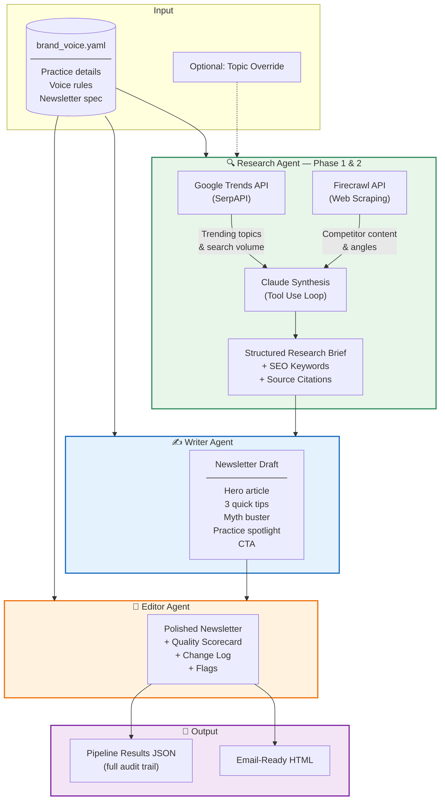

# Wellness Newsletter Generator — Multi-Agent Pipeline

A production-ready newsletter generation system for wellness practices, powered by a 3-agent AI pipeline with real-time research capabilities.

**Built by [Ken Gray](https://ciryx.ai) — Cloud Engineer & AI Consultant**

## What This Does

Drop in a YAML config for any wellness practice, run one command, and get a polished, brand-aligned newsletter — researched, written, edited, and rendered as email-ready HTML.

The system doesn't just generate content. It **discovers which of your services are trending**, scrapes real articles on the winner, writes in your brand voice, scores its own output, and remembers what it has already covered so each month picks something new.

## Architecture



## How It Works

### Topic Discovery (code-side, deterministic)

Before any LLM runs, the orchestrator ranks the practice's services against live Google Trends data using [pytrends-modern](https://pypi.org/project/pytrends-modern/). Each service in `brand_voice.yaml` gets a mean-interest score over the trailing 3 months. The highest-scoring service becomes the topic — the LLM never chooses, it only researches the winner.

This is deliberate: *data picks the topic, the agent fills in the story*. The ranking and winner are captured in the audit trail so you can always see why "medical weight loss" beat "peptide therapy" this month.

### Topic Memory (per-practice exclusion)

A SQLite database (`data/run_history.db`) records every successful run: practice, topic, discovery method, mean interest, timestamp. On each new run, the discovery step excludes topics covered in:

- the last **12 runs** for this practice, **OR**
- the last **90 days** — whichever is wider.

The next-highest-ranked topic wins instead. If every service has been recently covered, the system falls back to **oldest-first recycling** — the topic that hasn't been featured in the longest. Custom topic overrides (`--topic`) bypass discovery but still get recorded so future runs exclude them too.

### Research Agent (scrape + synthesize)

Given the pre-selected winning topic and its related search queries, the Research Agent runs an autonomous Firecrawl tool-use loop — scraping 2-3 real articles, then synthesizing a structured research brief with source URLs, SEO keywords (drawn from the actual related queries), and angle suggestions. Firecrawl results are truncated head-and-tail (~4KB each) to stay within input-token budgets.

### Writer + Editor Stages

Two specialized LLM stages produce the final newsletter:

- **Writer** — Takes the research brief + brand voice config and produces a complete draft in structured JSON (hero article, 3 tips, myth buster, practice spotlight, CTA).
- **Editor** — Reviews against brand voice rules, scores on four dimensions (voice alignment, readability, actionability, engagement), returns the polished newsletter + a scorecard + a change log + flags (e.g., medical claims to verify).

Both stages are single-call LLM passes, not tool-using agents. Turning them into full agents with self-verification tools (`check_brand_voice_compliance`, `pubmed_search` for claim checking, etc.) is the V2 roadmap.

### Design System (per-config templates)

The HTML output is driven by a Jinja template. Each practice's YAML can point at its own design file:

```yaml
newsletter:
  template: "templates/vitality_newsletter.html"
  wordmark: "Vitality"
  tagline: "A monthly letter for people in it for the long run."
```

The shipped **Vitality Wellness** template is a newsletter-letter layout (centered single column, masthead + issue strip + salutation + hero + prose + pull-quote + sign-off + subscribe CTA) on a sage/cream/blush palette with Cormorant Garamond + Manrope + JetBrains Mono. Practices without a `template` field fall back to a generic green-gradient HTML email. The template was designed in [claude.ai/design](https://claude.ai/design) and exported via handoff bundle.

### Audit Trail

Every run writes a `pipeline_results_[timestamp].json` containing the research brief (with `trend_discovery` fields: ranking, winner, winner_rank, excluded_as_recent, fallback_used), the writer draft, the editor scorecard, and a structured `pipeline_log` (~20 entries per run) with tool calls (input summary + output bytes), LLM calls (model, input/output tokens, stop reason), the topic discovery entry, and phase timestamps.

## Quick Start

```bash
# 1. Install dependencies
pip install -r requirements.txt

# 2. Copy .env.example to .env and fill in keys
ANTHROPIC_API_KEY=sk-ant-...
FIRECRAWL_API_KEY=fc-...          # web scraping (required for real sources)

# 3. Run
python main.py

# With options
python main.py --config config/vitality.yaml
python main.py --config config/radiance_medspa.yaml
python main.py --month "May 2026" --topic "peptide therapy for recovery"
```

Google Trends is queried via [pytrends-modern](https://pypi.org/project/pytrends-modern/) — no API key needed. Firecrawl is the only paid dependency beyond Anthropic.

## Configuration

Everything is driven by `config/brand_voice.yaml`. Swap this file to adapt the system to any practice:

```yaml
practice:
  name: "Your Practice Name"
  services: [...]
  audience: "..."

voice:
  tone: [Clear, Confident, Educational]
  do: [...]
  dont: [...]

newsletter:
  name: "Your Newsletter Name"
  sections: [...]
  style:
    max_words: 800
```

## Output

The pipeline produces:

| File | Contents |
|------|----------|
| `newsletter_[timestamp].html` | Email-ready HTML newsletter with inline CSS |
| `pipeline_results_[timestamp].json` | Full audit trail: research brief, draft, edits, scorecard, pipeline log |

## Project Structure

```
wellness-newsletter-system/
├── main.py                            # CLI entry point + run_pipeline()
├── orchestrator.py                    # Pipeline coordinator + HTML renderer
├── history.py                         # SQLite topic-memory helpers
├── ui.py                              # Themed Rich console
├── agents/
│   ├── research_agent.py              # Trend ranking + Firecrawl tool-use agent
│   ├── writer_agent.py                # Research brief → structured draft
│   └── editor_agent.py                # Draft → polished + scorecard
├── config/
│   ├── vitality.yaml                  # Concierge wellness (Vitality Wellness Center)
│   └── radiance_medspa.yaml           # Aesthetic med spa (portability proof)
├── templates/
│   └── vitality_newsletter.html       # Per-genre design (sage palette, newsletter-letter)
├── tests/
│   └── test_pipeline.py               # pytest regression suite
├── examples/
│   └── output/                        # Generated newsletters + pipeline results JSON
├── data/                              # SQLite topic memory (gitignored)
├── requirements.txt
└── README.md
```

## Why This Shape?

A single prompt can write a newsletter. It can't:

- **Separate topic selection from topic research** — The trend-ranking step runs in code against real Google Trends data. The LLM never picks the topic, which removes the most common failure mode (agent drifting to something interesting but untrending).
- **Remember what it has already covered** — Per-practice SQLite history with a 12-run / 90-day exclusion window, plus oldest-first recycling when services exhaust. A monthly newsletter pipeline has to produce a *different* topic each month.
- **Maintain separation of concerns** — Research (Firecrawl tool-use agent), writing (structured-JSON pass), and editing (score + change log + flags) are different skills with different evaluation criteria.
- **Produce an audit trail a buyer can read** — `pipeline_log` captures every tool call (input summary + output bytes), every LLM call (model, input/output tokens, stop reason), the full topic discovery record, and phase timestamps. ~20 structured entries per run.

V2 roadmap: Writer-as-agent with voice-compliance and readability tools, Editor-as-agent with PubMed verification for medical claims, sub-angle selection from `related_queries_rising` when services exhaust, multi-language / compliance / distribution agents.

## Tech Stack

- **Claude API** (Anthropic) — Research / Writer / Editor stages, all on Sonnet 4
- **pytrends-modern** — Deterministic topic ranking from real Google Trends data (no API key)
- **Firecrawl** — Web scraping for real article sources + differentiation angles
- **SQLite** — Per-practice topic memory (`data/run_history.db`)
- **Jinja2** — Per-genre HTML email templating (see `templates/vitality_newsletter.html`)
- **Rich** — Themed console output for pipeline runs
- **Python 3.10+** — Orchestration and tool dispatch

---

*Built by Ken Gray at [Ciryx AI](https://ciryx.ai) — AI consulting for businesses that want systems, not just prompts.*
