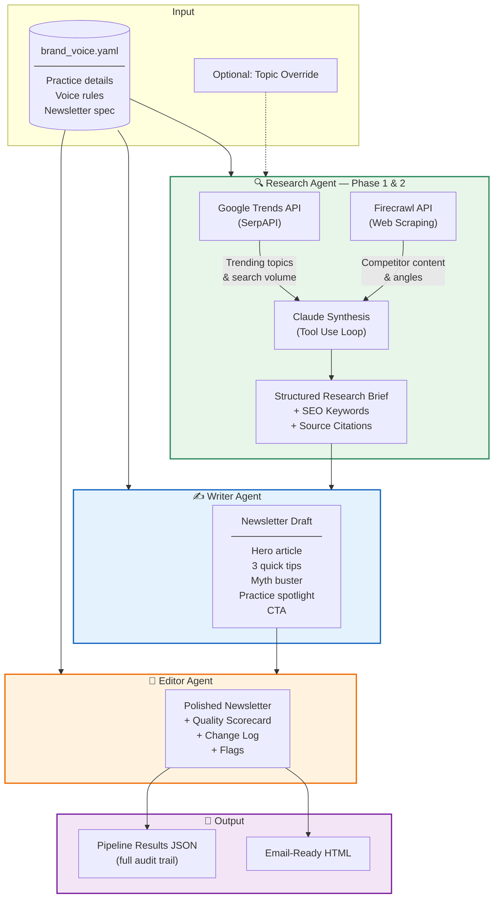

# Wellness Newsletter Generator — Multi-Agent Pipeline

A production-ready newsletter generation system for wellness practices, powered by a 3-agent AI pipeline with real-time research capabilities.

**Built by [Ken Gray](https://ciryx.ai) — Cloud Engineer & AI Consultant**

## What This Does

Drop in a YAML config for any wellness practice, run one command, and get a polished, brand-aligned newsletter — researched, written, edited, and rendered as email-ready HTML.

The system doesn't just generate content. It **researches what's actually trending**, scrapes competitor content for differentiation, writes in your brand voice, and scores its own output before delivering.

## Architecture



## How It Works

### Research Agent (with Tool Use)

The Research Agent doesn't rely on stale training data. It has two tools:

1. **Google Trends** (via SerpAPI) — Discovers what wellness topics are actually trending right now
2. **Firecrawl** — Scrapes top-ranking articles to find content gaps and differentiation angles

The agent runs an autonomous tool-use loop: it decides what to search, analyzes the results, decides what to scrape, then synthesizes everything into a research brief with real SEO keywords and source citations.

### Writer Agent

Takes the research brief + brand voice config and produces a complete newsletter draft. Every section maps to a defined template (hero article, tips, myth buster, spotlight, CTA). The output is structured JSON, not raw text — making it composable and testable.

### Editor Agent

Reviews the draft against brand voice rules and scores it on four dimensions: voice alignment, readability, actionability, and engagement potential. Returns the polished newsletter, a scorecard, a change log, and flags for anything the practice owner should review (e.g., medical claims that need verification).

## Quick Start

```bash
# 1. Install dependencies
pip install anthropic pyyaml jinja2

# 2. Set API keys
export ANTHROPIC_API_KEY=sk-ant-...
export SERPAPI_API_KEY=...        # Optional: enables Google Trends
export FIRECRAWL_API_KEY=fc-...   # Optional: enables web scraping

# 3. Run
python main.py

# With options
python main.py --month "May 2026" --topic "peptide therapy for recovery"
python main.py --config config/brand_voice.yaml --output ./my_output
```

> **Note:** The system works without SerpAPI and Firecrawl keys — the Research Agent falls back to Claude's training knowledge. But with the keys, it produces research grounded in real-time data.

## Configuration

Everything is driven by `config/brand_voice.yaml`. Swap this file to adapt the system to any practice:

```yaml
practice:
  name: "Your Practice Name"
  services: [...]
  audience: "..."

voice:
  tone: [Clear, Confident, Educational]
  do: [...]
  dont: [...]

newsletter:
  name: "Your Newsletter Name"
  sections: [...]
  style:
    max_words: 800
```

## Output

The pipeline produces:

| File | Contents |
|------|----------|
| `newsletter_[timestamp].html` | Email-ready HTML newsletter with inline CSS |
| `pipeline_results_[timestamp].json` | Full audit trail: research brief, draft, edits, scorecard, pipeline log |

## Project Structure

```
wellness-newsletter-system/
├── main.py                          # CLI entry point
├── orchestrator.py                  # Pipeline coordinator + HTML renderer
├── agents/
│   ├── research_agent.py            # Google Trends → Firecrawl → Brief
│   ├── writer_agent.py              # Research Brief → Newsletter Draft
│   └── editor_agent.py              # Draft → Polished + Scorecard
├── config/
│   └── brand_voice.yaml             # Practice config (swap per client)
├── examples/
│   └── output/
│       ├── example_newsletter.html  # Sample output
│       └── example_pipeline_results.json
├── requirements.txt
└── README.md
```

## Why Multi-Agent?

A single prompt can write a newsletter. But it can't:

- **Research autonomously** — The Research Agent decides what to search based on the practice's services and current trends
- **Maintain separation of concerns** — Research, writing, and editing are different skills with different evaluation criteria
- **Score its own work** — The Editor Agent provides a quality gate with an auditable scorecard
- **Produce an audit trail** — Every step is logged with inputs and outputs, so the practice owner can see exactly how the content was generated

This architecture is also **extensible**: add a Compliance Agent for healthcare, a Localization Agent for multi-language, or a Distribution Agent that pushes to Mailchimp — without touching existing agents.

## Tech Stack

- **Claude API** (Anthropic) — All three agents
- **Google Trends** via SerpAPI — Real-time trend discovery
- **Firecrawl** — Web scraping for competitive research
- **Jinja2** — HTML email templating
- **Python 3.10+** — Orchestration and tool dispatch

---

*Built by Ken Gray at [Ciryx AI](https://ciryx.ai) — AI consulting for businesses that want systems, not just prompts.*
# Wellness-Newsletter
